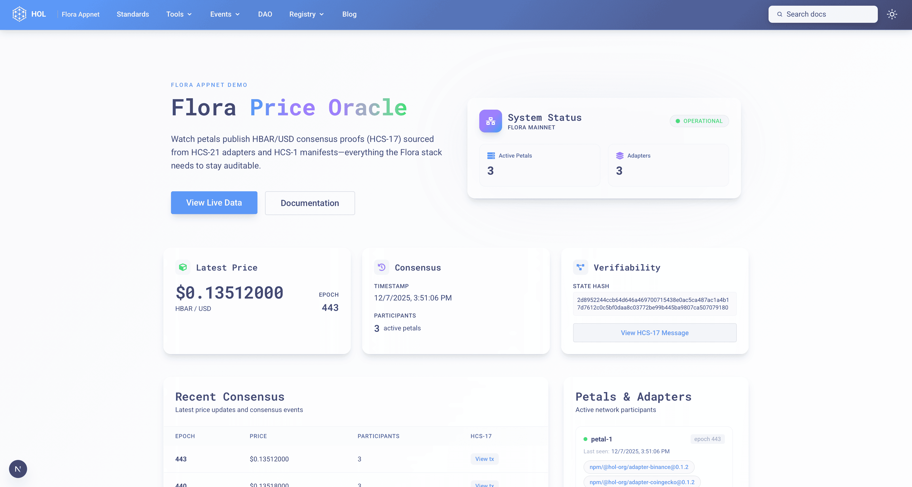

|  | A self-contained Flora/Petal demo appnet that shows how HCS-1/2/15/16/17/21 fit together to reach decentralized consensus on HBAR/USD prices. Everything is TypeScript, fully dockerized, and tuned to a ~2s cadence so you can watch proofs land on testnet in real time.<br><br>Built and maintained by [Hashgraph Online](https://hol.org).<br><br>[📚 Standards SDK Docs](https://hol.org/docs/libraries/standards-sdk/)<br>[📖 HCS Standards](https://hol.org/docs/standards) |
| :------------------------- | :------------------------------------------------------------------------------------------------------------------------------------------------------------------------------------------------------------------------------------------------------------------------------------------------------------------------------------------------------------------------------------------------------------------------------------------------------------------- |

# @hol-org/flora-price-oracle



## What it does
- Runs **3 Petal nodes** that fetch HBAR/USD prices from free sources (CoinGecko, Binance) and the Hedera mirror exchange-rate endpoint.
- Petals canonicalize adapter output, compute deterministic state hashes, and publish HCS‑17 proofs.
- The consumer reads proofs from mirror, waits for quorum (2 of 3) on a matching state hash, computes a median price, and exposes it over HTTP.
- Topics, registry, and manifests are created automatically via the standards-sdk on first boot (no manual TopicCreateTransaction).
- The dashboard mirrors Hashgraph Online branding and links every topic/pointer (discovery → category → per-adapter version pointer → per-adapter declarations → manifests) plus the HCS‑17 proofs.
- Everything lives in the repo: adapters are real npm packages (`@hol-org/*`), manifests are inscribed on-chain (HCS‑1), and all topics are persisted in Postgres for repeatable runs.

## Standards in use
- **HCS-1** manifests and registry metadata (immutable YAML).
- **HCS-2** discovery + category + per-adapter version pointers.
- **HCS-15** Petal account provisioning.
- **HCS-16** coordination/transaction topics (membership + lifecycle).
- **HCS-17** state hashes for consensus proofs.
- **HCS-21** adapter declarations and layered registry (discovery → category → version pointer → declaration topics).

## Quickstart (Hedera testnet)

1) Export Hedera credentials (or add to `.env`) and install deps (pnpm preferred):
```
pnpm install
```

2) Set env in `config/consumer.env` and `config/petal-*.env` (examples already reference these vars):
```
HEDERA_NETWORK=testnet
HEDERA_ACCOUNT_ID=...
HEDERA_PRIVATE_KEY=...
FLORA_PARTICIPANTS=petal-1,petal-2,petal-3
THRESHOLD_FINGERPRINT=demo-threshold
BLOCK_TIME_MS=2000
QUORUM=2
EXPECTED_PETALS=3
MIRROR_BASE_URL=https://testnet.mirrornode.hedera.com
```
You do **not** need to pre-create topics. On first boot the consumer:
- Creates HCS-17 state/coordination/transaction topics (HCS-16 memos) and stores them in Postgres.
- Creates an HCS-21 adapter registry topic and inscribes adapter manifests (HCS-1).
- Publishes @hol-org adapter declarations to the registry topic.

3) Run the stack:
```
docker compose up -d
```

Check it:
```
curl http://localhost:3000/price/latest
curl http://localhost:3000/price/history?limit=5
curl http://localhost:3000/adapters
# Dashboard
open http://localhost:3101
```

## How the topics are wired
- On first boot the consumer creates:
  - HCS‑17 state topic + HCS‑16 coordination/transaction topics.
  - HCS‑2 discovery topic (registry-of-registries) and an HCS‑21 adapter category topic.
  - Per-adapter HCS‑2 version pointer topics and per-adapter HCS‑21 declaration topics.
  - HCS‑1 manifests for each adapter plus HCS‑1 registry metadata.
- The `/adapters` endpoint returns all resolved topic IDs so you can click through to Hashscan.
- The dashboard sidebar lists discovery, category, per-adapter version/declaration topics, and manifests.

## Services
- `flora-consumer`: reads HCS‑17 proofs from `STATE_TOPIC_ID`, verifies matching state hashes, aggregates price, serves `/price/latest` and `/price/history`.
- `petal-1`, `petal-2`, `petal-3`: fetch adapter data every 2s, publish proofs to the state topic using adapter declarations from `ADAPTER_REGISTRY_TOPIC_ID`.
- `flora-dashboard`: default dev server (hot reload) that bind-mounts `dashboard/`, runs `pnpm dev`, and exposes http://localhost:3101. Restart automatically reuses cached pnpm store + node_modules volumes so edits reflect instantly without rebuilding.
- `flora-dashboard-prod` (opt-in via `docker compose --profile prod up -d flora-dashboard-prod`): builds the optimized Next.js image and serves it on http://localhost:3100 for production-style validation.

### Dashboard hot reload workflow
1. Ensure the backend stack is running (`docker compose up -d flora-consumer petal-1 petal-2 petal-3`).
2. Start the dashboard: `docker compose up -d flora-dashboard` (hot reload enabled by default).
3. Visit http://localhost:3101 for the dev server. To preview the production build, run `docker compose --profile prod up -d flora-dashboard-prod` and open http://localhost:3100.
4. Edit files under `dashboard/`; Tailwind and Next reload automatically via the bind mount. The container caches dependencies inside the `dashboard-dev-node_modules` and `dashboard-dev-pnpm-store` volumes, so the first run installs pnpm deps and subsequent runs reuse them.

## Config
- `config/consumer.env`, `config/petal-*.env` are `.env`-style and pulled by docker-compose.
- Topics and registry IDs are persisted in Postgres `app_state` on first boot; subsequent restarts reuse them.
- Block time: `2000` ms; quorum: `2` of `3`; threshold fingerprint: `demo-threshold` (demo-only).

## Endpoints
- `GET /price/latest` – Latest consensus price (after quorum), includes `hcsMessage` pointer.
- `GET /price/history?offset=0&limit=50` – Paginated consensus entries (newest first; `limit` max 200).
- `GET /adapters` – Per-petal adapter set and aggregate fingerprints.
- `GET /health` – Basic health check.

## Notes
- Petals publish HCS‑17 proofs to the persisted state topic and include adapter fingerprints plus the registry topic id.
- Containers use lean multi-stage Alpine builds (Node 24 for services, Node 24/22 for dashboard build/runtime).
- Adapters live under `packages/` and are published on npm under `@hol-org/*`; integrity hashes in HCS‑21 declarations are derived from the tarballs.
- Manifests are inscribed via HCS-1 (pointer `hcs://1/<topicId>`); no IPFS.

## Non-production notice
- This repository is an educational/demo appnet: it is not hardened, not monitored, and not intended for mainnet use.
- Keys in `.env` and generated petal accounts are for local testnet only; rotate and manage real secrets externally.
- Consensus cadence, block time, and quorum are tuned for quick visualization, not economic guarantees.
- The adapter list is fixed for the demo; extend or replace adapters before any real deployment.
 - State is stored in Postgres for reproducibility; do not rely on this layout for production secrets.

## Adapters & publishing
- Published on npm (canary tag):
  - `@hol-org/adapter-binance@0.1.2` (integrity: `d76fdbde3f688cd2f88fd5c0c6a1640d0985358d6e2defef1d8082a93d9d15f6be80886c036be017f0476885fcf1649b`)
  - `@hol-org/adapter-coingecko@0.1.2` (integrity: `48b8eb0b470311152b59e0d4f1526bed1dc294cb9e4ff04239c9e44e5a4887446a844da8a62fc4485346aea7766796f9`)
  - `@hol-org/adapter-hedera-rate@0.1.2` (integrity: `ecc1aff4b77e28b46b4fbdef1fc722f62276db4f2bf4e6c45715bdc0442d9de2556920b5d3f80e3e241fd4909657367c`)
- Packed tarballs live in `packages/.dist/` (built via `pnpm pack`); these hashes are embedded in the HCS‑21 declarations the consumer publishes.
- To republish (if you change code), run: `pnpm -r --filter "./packages/*" publish --access public --tag canary --no-git-checks`

## What this demo provisions automatically
- **Adapter registry topic (HCS-21):** On first boot, the consumer creates the registry topic, inscribes manifests (HCS-1), publishes @hol-org declarations, and persists the topic id in Postgres.
- **State/coordination/transaction topics (HCS-16/17):** Created once via standards-sdk memos; persisted to Postgres for re-use.
- **Postgres state:** `app_state` holds topic IDs and manifest pointers; `consensus_entries` stores every consensus round (epoch, state hash, price, participants, sources, HCS pointer).
- **Consensus workflow:** Petals fetch adapters from the registry, compute records, publish proofs. The consumer watches mirror, verifies state hashes and registry topic id, then writes consensus rows.

## How to observe the appnet in action
- **Latest consensus price:** `curl http://localhost:3000/price/latest`
- **History:** `curl http://localhost:3000/price/history`
- **DB check:** `docker exec flora-postgres psql -U flora -d flora -c "select max(epoch),count(*) from consensus_entries;"`
- **HCS topics (mirror):**
  - Adapter registry: `https://testnet.mirrornode.hedera.com/api/v1/topics/${ADAPTER_REGISTRY_TOPIC_ID}/messages`
  - State proofs: `https://testnet.mirrornode.hedera.com/api/v1/topics/${STATE_TOPIC_ID}/messages`

## Expected outcomes
- Three demo adapters (@hol-org/adapter-binance, @hol-org/adapter-coingecko, @hol-org/adapter-hedera-rate) registered on the adapter registry topic.
- Continuous HCS‑17 proof stream on the state topic with matching `stateHash` across petals.
- Postgres populated with consensus rows and the registry topic id, showing end-to-end Flora/Petal consensus over adapter-sourced data.

## Stopping
```bash
docker compose down
```

## Contributing
Please read our [Contributing Guide](https://github.com/hashgraph-online/standards-sdk/blob/main/CONTRIBUTING.md) and [Code of Conduct](https://github.com/hashgraph-online/standards-sdk/blob/main/CODE_OF_CONDUCT.md) before contributing. For bugs and feature requests, open issues using the [templates](https://github.com/hashgraph-online/standards-sdk/issues/new/choose).

## Security
For security concerns, see the [Security Policy](https://github.com/hashgraph-online/standards-sdk/blob/main/SECURITY.md).

## Maintainers
Maintainers are listed in [MAINTAINERS.md](https://github.com/hashgraph-online/standards-sdk/blob/main/MAINTAINERS.md).

## Resources
- [HCS Standards Documentation](https://hol.org/docs/standards)
- [Hedera Documentation](https://docs.hedera.com)
- [Telegram Community](https://t.me/hashinals)

## License
Apache-2.0
